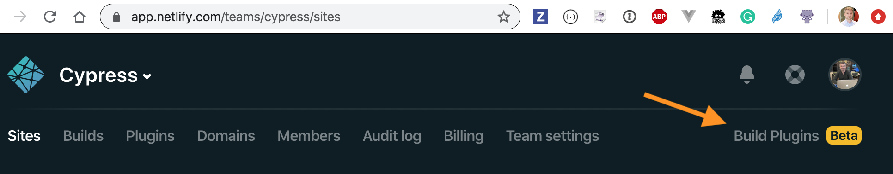
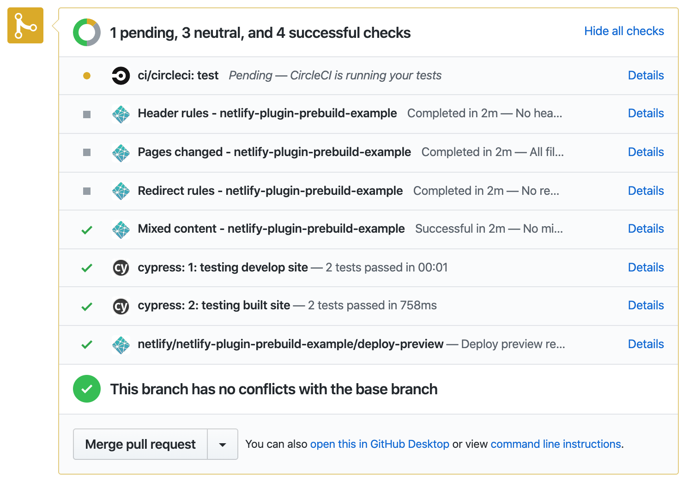

# netlify-plugin-cypress [](https://circleci.com/gh/cypress-io/netlify-plugin-cypress/tree/master) [![renovate-app badge][renovate-badge]][renovate-app]
> Runs Cypress end-to-end tests after Netlify builds the site but before it is deployed

**Note:** currently the built site is served statically and tested _without proxying redirects_.

## Install and use

Enable Netlify Build Plugins Beta from `https://app.netlify.com/teams/<your team name>/enable-beta` for the projects that need to use this plugin. Here is the link from the Netlify UI



Add `netlify-plugin-cypress` NPM package as a dev dependency to your repository.

```shell
npm install --save-dev netlify-plugin-cypress
# or
yarn add -D netlify-plugin-cypress
```

And then add the plugin's name to the list of build plugins in `netlify.toml` file as shown in the examples below.

*note:* this plugin assumes you have already installed Cypress as a dev NPM dependency.

## How does it work

When Netlify Build runs, it "knows" the output folder name and calls the `netlify-plugin-cypress` after the build has finished with that folder. Then the plugin runs Cypress tests using its [NPM module API](https://on.cypress.io/module-api). If the tests pass, the plugin finishes and the Netlify deploy starts.

## Examples

### basic

Here is the most basic [Netlify config file](https://docs.netlify.com/configure-builds/file-based-configuration/) `netlify.toml` with just the Cypress plugin

```toml
[[plugins]]
  # local Cypress plugin will test our site after it is built
  package = "netlify-plugin-cypress"
```

The example file above should be enough to run Cypress tests in any existing Netlify project.

### recommended

We strongly recommend setting `CYPRESS_CACHE_FOLDER` to place the Cypress binary _inside the node_modules_ folder to [cache it between builds](https://on.cypress.io/caching)

```toml
# explicit commands for building the site
# and the folder to publish
[build]
command = "npm run build"
publish = "build"

[build.environment]
# cache Cypress binary in local "node_modules" folder
# so Netlify caches it
CYPRESS_CACHE_FOLDER = "./node_modules/CypressBinary"
# set TERM variable for terminal output
TERM = "xterm"

[[plugins]]
# local Cypress plugin will test our site after it is built
package = "netlify-plugin-cypress"
```

See [netlify-plugin-cypress-example](https://github.com/cypress-io/netlify-plugin-cypress-example) repo.

Typescript users may need to add a `install` before the build command. For a yarn user with a typescript app, the build section of the Netlify configuration might look like this:

```toml
[build]
command = "yarn install && yarn build"
publish = "build"

# ...remaining configuration...
```

### recording

To record test results and artifacts on Cypress Dashboard, set `record: true` plugin input and set `CYPRESS_RECORD_KEY` as an environment variable via Netlify Deploy settings.

```yaml
[build]
command = "npm run build"
publish = "build"
  [build.environment]
  # cache Cypress binary in local "node_modules" folder
  # so Netlify caches it
  CYPRESS_CACHE_FOLDER = "./node_modules/CypressBinary"
  # set TERM variable for terminal output
  TERM = "xterm"

[[plugins]]
# local Cypress plugin will test our site after it is built
package = "netlify-plugin-cypress"
  [plugins.inputs]
  record = true
```

See [cypress-example-kitchensink](https://github.com/cypress-io/cypress-example-kitchensink) and recorded results at [](https://dashboard.cypress.io/#/projects/4b7344/runs)

**Security note 🔐:** you should keep your `CYPRESS_RECORD_KEY` secret. You can control how Netlify builds external pull requests, see [the doc](https://docs.netlify.com/configure-builds/environment-variables/) - you never want to expose sensitive environment variables to outside builds.

#### status checks

If you are recording test results to Cypress Dashboard, you should also install [Cypress GitHub Integration App](https://on.cypress.io/github-integration) to see status checks from individual groups or from individual specs per commit. See [netlify-plugin-prebuild-example PR #8](https://github.com/cypress-io/netlify-plugin-prebuild-example/pull/8) pull request for an example.



#### group

You can change the group name for the recorded run using `group` parameter

```toml
[[plugins]]
# local Cypress plugin will test our site after it is built
package = "netlify-plugin-cypress"
  [plugins.inputs]
  record = true
  group = "built site"
```

#### tag

You can give recorded run [tags](https://on.cypress.io/module-api#cypress-run) using a comma-separated string. If the tag is not specified, Netlify context will be used (`production`, `deploy-preview` or `branch-deploy`)

```toml
[[plugins]]
# local Cypress plugin will test our site after it is built
package = "netlify-plugin-cypress"
  [plugins.inputs]
  record = true
  group = "built site"
  tag = "nightly,production"
```

### spec

Run only a single spec or specs matching a wildcard

```toml
[build]
command = "npm run build"
publish = "build"
  [build.environment]
  # cache Cypress binary in local "node_modules" folder
  # so Netlify caches it
  CYPRESS_CACHE_FOLDER = "./node_modules/CypressBinary"
  # set TERM variable for terminal output
  TERM = "xterm"

[[plugins]]
# local Cypress plugin will test our site after it is built
package = "netlify-plugin-cypress"
  [plugins.inputs]
  spec = "cypress/integration/smoke*.js"
```

See [cypress-example-kitchensink](https://github.com/cypress-io/cypress-example-kitchensink) for instance.

### testing SPA routes

SPAs need catch-all redirect setup to make non-root paths accesssible by tests. You can enable this with `spa` parameter.

```
[[plugins]]
# local Cypress plugin will test our site after it is built
package = "netlify-plugin-cypress"
  [plugins.inputs]
  # can also use "spa = true" to use "index.html" by default
  spa = "index.html"
```

See [lws-spa](https://github.com/lwsjs/spa) for more options and [tests/routing](tests/routing) example.

### testing the site before build

By default this plugin tests static site _after build_. But maybe you want to run end-to-end tests against the _local development server_. You can start local server, wait for it to respond and then run Cypress tests by passing parameters to this plugin. Here is a sample config file

```toml
[[plugins]]
  package = "netlify-plugin-cypress"
  # let's run tests against development server
  # before building it (and testing the built site)
  [plugins.inputs.preBuild]
    start = 'npm start'
    wait-on = 'http://localhost:5000'
    wait-on-timeout = '30' # seconds
```

Parameters you can place into `preBuild` inputs: `start`, `wait-on`, `wait-on-timeout`, `spec`, `record`, `group`, and `tag`. If there is `preBuild` and `postBuild` testing with different tags, the first one wins :)

See [netlify-plugin-prebuild-example](https://github.com/cypress-io/netlify-plugin-prebuild-example) repo

## Example repos

Name | Description
--- | ---
[netlify-plugin-cypress-example](https://github.com/cypress-io/netlify-plugin-cypress-example) | Runs Cypress tests on Netlify and records their results to Cypress Dashboard
[netlify-plugin-prebuild-example](https://github.com/cypress-io/netlify-plugin-prebuild-example) | Runs tests twice, first using the development version of the site, then after Netlify builds the production bundles, runs the tests again
[cypress-example-kitchensink](https://github.com/cypress-io/cypress-example-kitchensink) | Runs only a subset of all tests before publishing the folder to Netlify

## Debugging

Set environment variable `DEBUG=netlify-plugin-cypress` to see the debug logs. To see even more information, set `DEBUG=netlify-plugin-cypress,netlify-plugin-cypress:verbose`

## Common problems

<details>
  <summary>Too many progress messages while installing Cypress</summary>
  If you see A LOT of progress messages during "npm install" step, set an environment
  variable during build <code>CI = 1</code> to remove them.
</details>

<details>
  <summary>Cypress binary is installed on every build</summary>
  By default Cypress binary is installed in the home folder, see <a href="">caching</a>.
  Netlify build does NOT cache this folder, but it DOES cache the local "node_modules" folder.
  Tell Cypress to install its binary in the "node_modules" folder by setting build environment
  variable <code>CYPRESS_CACHE_FOLDER = "./node_modules/CypressBinary"</code>.
</details>

<details>
  <summary>Several versions of Cypress are installed according to the build logs</summary>
  From the Netlify UI under Deploys, pick "Trigger Deploy" and select "Clear cache and deploy site". This should cleanly install new "node_modules" and remove old Cypress versions.
</details>

<details>
  <summary>Term message warnings in the Cypress output</summary>
  If you see messages like <code>tput: No value for $TERM and no -T specified</code> during
  Cypress run, add an environment variable <code>TERM = xterm</code>.
</details>

## License

This project is licensed under the terms of the [MIT license](LICENSE.md).

## Contributing

Read the [contributing guide](CONTRIBUTING.md)

[renovate-badge]: https://img.shields.io/badge/renovate-app-blue.svg
[renovate-app]: https://renovateapp.com/
